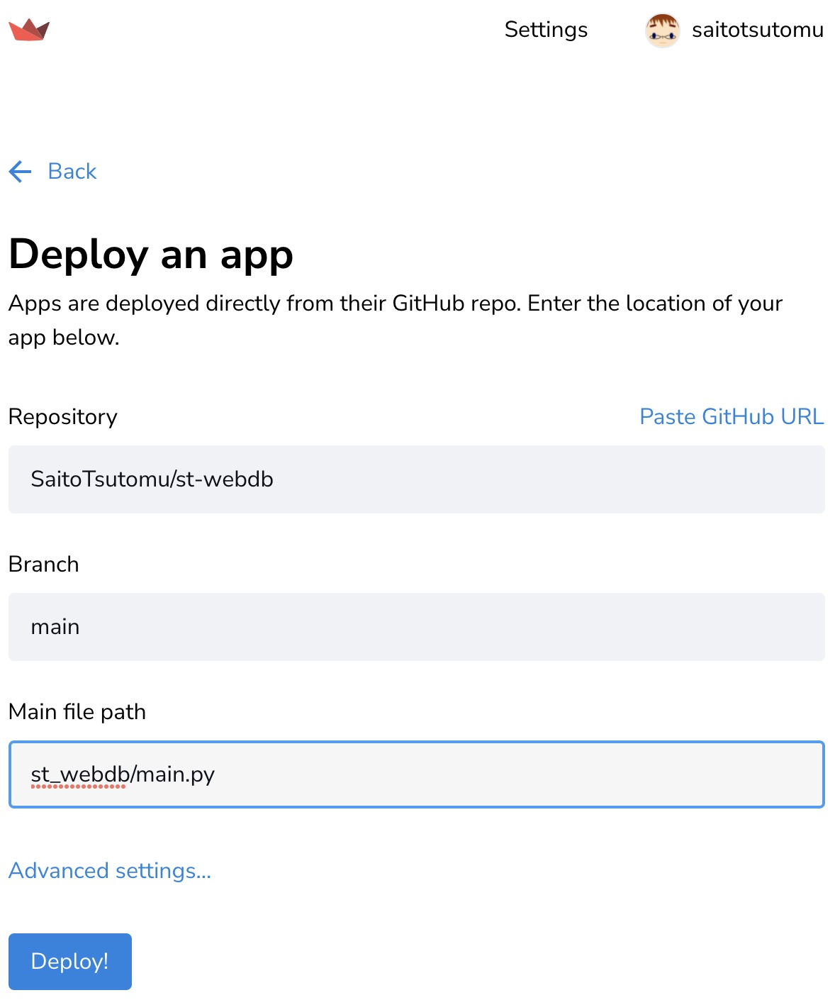
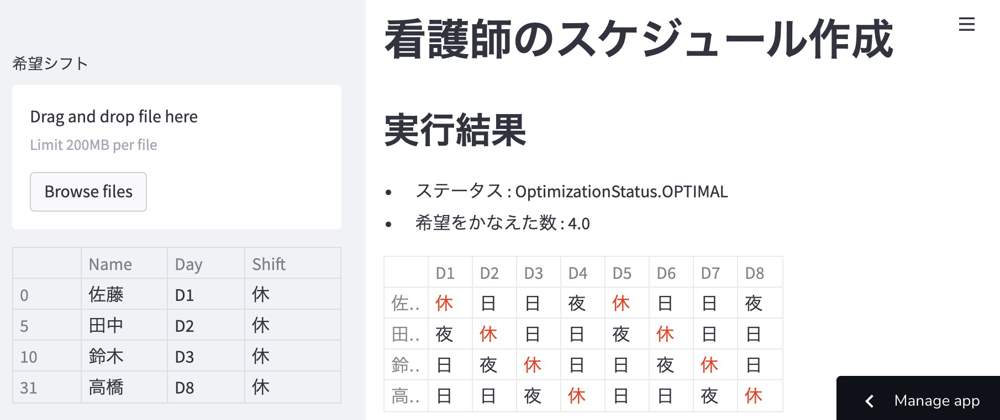
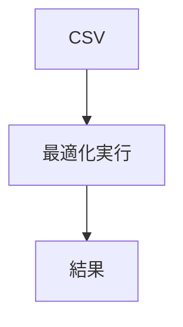

## はじめに

[Streamlit Cloud](https://streamlit.io/cloud)のテスト用です。

内容は、[WEB+DB PRESS Vol.122](https://gihyo.jp/magazine/wdpress/archive/2021/vol122)の「Pythonではじめる数理最適化」のコードです。

## 本リポジトリ作成手順

- Pythonは、3.7にすること（3.9だとStreamlit Cloudのcffiでエラーになるため）
- `poetry new st-webdb`で新規作成し、`cd st-webdb`
- GitHubで使えるようにする
- `poetry add streamlit mip`でライブラリーのインストール
- 入力サンプルの`wish.csv`を用意する
- `st_webdb/main.py`を作成し、後述の実行方法で動くようにする

## 実行方法

```
poetry run streamlit run st_webdb/main.py
```

## Streamlit Cloudで動かすために

- https://streamlit.io/cloud を開きサインインする
- 「New app」を押す（下図）


- 下図のように入力し「Deploy!」を押す



しばらく待つと、下記のように表示されます。





